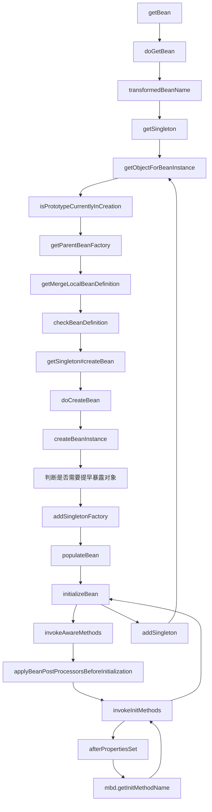

```mermaid
graph TB;
getBean --> doGetBean
doGetBean --> transformedBeanName
transformedBeanName --> getSingleton
getSingleton --> getObjectForBeanInstance
getObjectForBeanInstance --> isPrototypeCurrentlyInCreation
isPrototypeCurrentlyInCreation --> getParentBeanFactory
getParentBeanFactory --> getMergeLocalBeanDefinition
getMergeLocalBeanDefinition --> checkBeanDefinition
checkBeanDefinition --> getSingleton#createBean
getSingleton#createBean --> doCreateBean
doCreateBean --> createBeanInstance
createBeanInstance --> 判断是否需要提早暴露对象
判断是否需要提早暴露对象 --> addSingletonFactory
addSingletonFactory --> populateBean
populateBean --> initializeBean
initializeBean --> invokeAwareMethods
invokeAwareMethods --> applyBeanPostProcessorsBeforeInitialization
applyBeanPostProcessorsBeforeInitialization --> invokeInitMethods
invokeInitMethods --> afterPropertiesSet
afterPropertiesSet --> mbd.getInitMethodName
mbd.getInitMethodName -->invokeInitMethods
invokeInitMethods --> initializeBean
initializeBean --> addSingleton
addSingleton --> getObjectForBeanInstance
```

